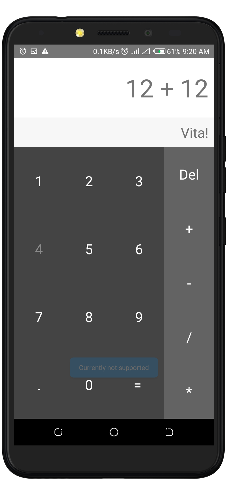

# Vita Awesome-Calculator       []

Awesome-Calculator is a simple app that helps calculate and perform simple mathematical operations on the go, without having to worry about mistaing and misplacement of numbers.

The app was built on **React Native**. and can be used to perform the following operations:

* Addition - Returns the sum of two or more numbers
* Subtraction - Returns the differencr between two or more numbers
* Division - Returns the quotient of two or more numbers
* Multiplication -  Returns the product of tow or more numbers.

> The final apk can be downloaded here : <insert link>

> The Balsamiq Mockup can be downloaded here : <insert link>

## Prerequisites
You will need the following to run this project:
1. A laptop or desktop machine with internet access
2. Android Studio 3.1 Stable Channel (Latest Stable Release)
3. React Native Configured and Working on your system

## Setting Up
* Clone the Repository from Github
* Open the project folder using any editor of choice
* Run the command `npm install`
* Start the project using the command `react-native run andriod` for Andriod Devices
* Start the project with the command `react-native run ios` for IOS Devices

### The App Layout Page
This application has a simple layout, with a very good, attractive and awesome interface as shown:

### Updates and Collaboration
* This application is still maintained
* Feel free to fork, start and contribute to this project

